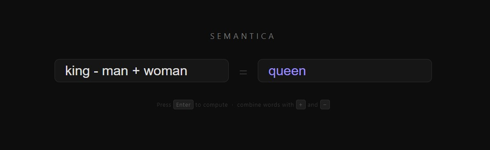

# Semantica
**The Geometry of Meaning: A Word Embedding Exploration Tool**

Semantica is a navigational tool for the hidden "map" of human language. It treats language not as a sequence of letters, but as a high-dimensional geometric space where word meaning is defined by physical coordinates.

---

## The Theory: How Words Become Space

### 1. The Language of Coordinates
Humans understand words through context and emotion. Computers, however, only understand numbers. To bridge this gap, we use **Word Embeddings**. 

Imagine every word in the English language is a floating point in a dark, infinite void. 
* Words with similar meanings (like *Ocean* and *Sea*) are clustered tightly together.
* Opposites or unrelated words (like *Apple* and *Justice*) are miles apart.

### 2. The 300-Dimensional "Point Cloud"
In a 3D software like Houdini or Maya, a point is defined by 3 coordinates: $(X, Y, Z)$. 
Semantica operates in a **300-dimensional space**. Every word is a vector—a "pointer" from the center of the universe $(0,0,0...)$ to a specific coordinate in this massive 300-axis grid. These extra dimensions allow the computer to capture subtle nuances: one axis might represent "masculinity," another "royalty," and another "temperature."

### 3. Static Embeddings (GloVe)
This project utilizes **GloVe (Global Vectors for Word Representation)**. These are "static" embeddings, meaning the computer has pre-scanned billions of lines of text (from Wikipedia and the web) to calculate these coordinates based on **co-occurrence**. If two words frequently appear near each other in the real world, they are moved closer together in the vector space.

---

## Semantic Arithmetic
The true magic of Semantica is that because words are numbers, you can perform math on them to uncover cultural relationships and linguistic logic.

$$Vector(\text{"King"}) - Vector(\text{"Man"}) + Vector(\text{"Woman"}) \approx Vector(\text{"Queen"})$$

By subtracting the "man" vector from "king," we mathematically strip away the concept of masculinity while retaining "royalty." Adding "woman" applies femininity to that royal essence, landing us at the coordinates for "queen."

---

## Tech Stack & Architecture

Semantica is built as a lightweight, high-performance engine for spatial language analysis.

### The Backend (The Engine)
* **Language:** Python 3.x
* **Math Engine:** [NumPy](https://numpy.org/). We use vectorized matrix operations to calculate Euclidean distance and Cosine Similarity across 400,000+ words in milliseconds.
* **Data Source:** GloVe 6B (300-dimensional vectors).

### The Frontend (The Interface)
* **CLI / Web Interface:** A minimalist interface designed for rapid expression evaluation.
* **Parser:** A custom regex-based expression evaluator that translates human-readable strings (like `paris - france + italy`) into NumPy-executable operations.

---

## Getting Started

### 1. Prerequisites
* Python 3.10+
* NumPy

### 2. Database Setup
The core logic uses [GloVe embeddings](https://nlp.stanford.edu/projects/glove/). 
1.  Download `glove.6B.zip`.
2.  Extract the contents.
3.  Place `glove.6B.300d.txt` into the `/database` folder.

### 3. Usage
- Install Python, 
- Download/clone repo, 
- Download embedings file (database setup), 
- Fix and run semantica.bat (change path to Python).